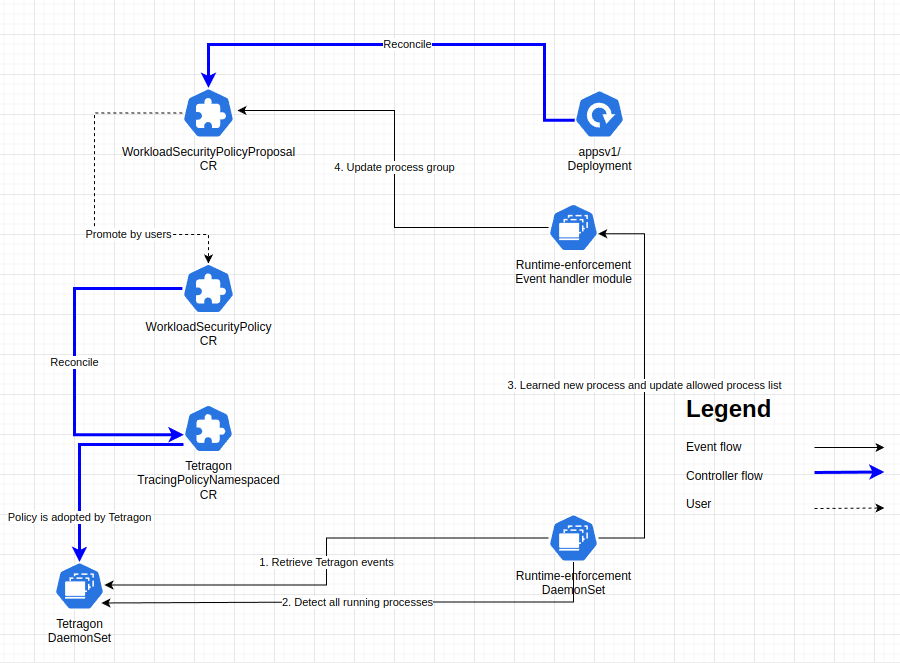

|              |                     |
| :----------- | :------------------ |
| Feature Name | runtime-enforcement |
| Start Date   | Apr. 4th, 2025      |
| Category     | CRDs, APIs          |
| RFC PR       |                     |
| State        | **ACCEPTED**        |

- [Summary](#summary)
- [Motivation](#motivation)
  - [User Stories](#user-stories)
    - [Learn phase](#learn-phase)
    - [Monitor phase - learnt policy](#monitor-phase---learnt-policy)
    - [Monitor phase - policy tuning](#monitor-phase---policy-tuning)
    - [Monitor phase - user made policy](#monitor-phase---user-made-policy)
    - [Enforce phase - policy promotion](#enforce-phase---policy-promotion)
    - [Enforce phase - multiple clusters](#enforce-phase---multiple-clusters)
    - [Enforce phase - cluster-wide policy](#enforce-phase---cluster-wide-policy)
    - [Enforce phase - multiple clusters and cluster-wide policies](#enforce-phase---multiple-clusters-and-cluster-wide-policies)
- [Detailed design](#detailed-design)
  - [CRDs](#crds)
  - [WorkloadSecurityPolicyProposal](#workloadsecuritypolicyproposal)
    - [Definitions](#definitions)
  - [WorkloadSecurityPolicy](#workloadsecuritypolicy)
    - [How WorkloadSecurityPolicy is reconciled into TracingPolicyNamespaced](#how-workloadsecuritypolicy-is-reconciled-into-tracingpolicynamespaced)
    - [Policy Generation](#policy-generation)
  - [ClusterWorkloadSecurityPolicy](#clusterworkloadsecuritypolicy)
- [Architecture Diagram](#architecture-diagram)
- [Drawbacks](#drawbacks)
- [Alternatives](#alternatives)
- [Unresolved questions](#unresolved-questions)
    - [CR size limit: ProcessGroup and TracingPolicy](#cr-size-limit-processgroup-and-tracingpolicy)
    - [Container selector: Tetragon has limited functionalities to support container-level policy at this moment.](#container-selector-tetragon-has-limited-functionalities-to-support-container-level-policy-at-this-moment)
    - [Allow rules and policy order](#allow-rules-and-policy-order)
    - [Ignore events from kubectl exec, kubectl debug.](#ignore-events-from-kubectl-exec-kubectl-debug)

# Summary

[summary]: #summary

Runtime Enforcer: Auto-Grouping and Behavior-Learning

# Motivation

[motivation]: #motivation

One of the advantage of NeuVector/SUSE Security is that we can group similar workloads automatically and learn their behavior automatically.  With this information, we can show insights of containers and provide users the ability to create security policies more easily.

As we are moving to a different architecture, this RFC includes the proposal of CRDs and related functionalities for this functionality.

## User Stories

### Learn phase

As a cluster operator I want to create security profiles of the workloads running inside of my cluster, so that:

- Only binaries on an allow list can be run inside of the pods
- Only binaries located under trusted paths can be run inside of the pods

Given I don't have a clear understanding of the workload behavior, I want SUSE Security to create a security policy for my workloads by observing their behavior.
SUSE Security observes the running workloads and, for each one of them, creates a `WorkloadSecurityPolicyProposal`.

The `WorkloadSecurityPolicyProposal` resources is created next to the workloads that have been observed, meaning in the same namespace.

### Monitor phase - learnt policy

As a cluster operator I want to secure a workload running inside of my cluster without breaking its regular behavior. Moreover,
if the same workload is running inside of other namespaces, I don't want the policy to affect all of them. The policy should be
applied only against the workload that I selected.

For example, I want to secure a PostgreSQL workload running inside of the `testing` namespace, but not the one running inside of the `infra-team` namespace.

To assess the reliability of a `WorkloadSecurityPolicyProposal` created by SUSE Security, I promote the `WorkloadSecurityPolicyProposal`
to become a `WorkloadSecurityPolicy`. However, I deploy it using the `monitor` mode, to ensure it doesn't break the actual workload
if it's lacking some information about its behavior.

### Monitor phase - policy tuning

As a cluster operator, I want to change the operation mode of a workload policy from `monitor` to `protect` mode, so that
the workload is secured and only allowed binaries can run inside of it.

I don't want however to break the workload behavior, hence I iterate over the following steps:

- Monitor the violations of the `WorkloadSecurityPolicy` reported by SUSE Security
- Assess the violations, add new binaries to the allow list by either changing the `WorkloadSecurityPolicy` manually or by using the remediation
  action proposed by SUSE Security UI.

### Monitor phase - user made policy

As a cluster operator I want to secure a workload running inside of my cluster without breaking its regular behavior.
Given this is a well known workload, I search for ready to use `WorkloadSecurityPolicy` definitions on the following places:

- Rancher Application Collection: some workloads have tailor made security profiles maintained by SUSE
- Company DevSecOps team: this internal team provides an up-to-date list of profiles for the company approved workloads
- 3rd party source: upstream project, blog,...

After careful review, I apply the `WorkloadSecurityPolicy` inside of the cluster, using the `monitor` mode.
I create the `WorkloadSecurityPolicy` resource in the same namespace where the workload is running.
The policy must affect only the workload running inside of that namespace.

### Enforce phase - policy promotion

As a cluster operator I want to secure a workload running inside of my cluster without breaking its regular behavior.
Given the `WorkloadSecurityPolicy` that monitors the workload is not producing false positives, I enforce the policy
by changing its `mode` from `monitor` to `protect`.

### Enforce phase - multiple clusters

As a cluster operator I want to secure a workload running inside of all the clusters I manage.
Given my clusters are managed centrally, I use my GitOps solution to create a `WorkloadSecurityPolicy` inside of all my clusters.
All the policies are created with `mode` set to `protect`, given I've done careful testing of these profiles and I trust them
to not break the workloads.

### Enforce phase - cluster-wide policy

As a cluster operator I want to secure all the instances of a given workflow that are running inside of the cluster, regardless of the namespace they are located.

Given:

- the workload is deployed with a set of well-defined labels
- I've already tested the impact of a `WorkloadSecurityPolicy` against a workload running inside of a testing namespace

I promote the `WorkloadSecurityPolicy` to become a `ClusterWorkloadSecurityPolicy`. The `WorkloadSecurityPolicy` is removed and `ClusterWorkloadSecurityPolicy`
is created.

### Enforce phase - multiple clusters and cluster-wide policies

As a cluster operator I want to secure a workload running inside of all the clusters I manage.
Given my clusters are managed centrally, I use my GitOps solution to create a `ClusterWorkloadSecurityPolicy` inside of all my clusters.
All the policies are created with `mode` set to `protect`, given I've done careful testing of these profiles and I trust them
to not break the workloads.


# Detailed design

[design]: #detailed-design

## CRDs

Three CRDs are proposed in this RFC:

- `WorkloadSecurityPolicyProposal` is generated by us, based on what we learn by watching system behavior.
  - In addition to a label selector used to match workloads, it also includes a field to contain the behavior we learn.
- `WorkloadSecurityPolicy` share many fields with `WorkloadSecurityPolicyProposal`.
  - `WorkloadSecurityPolicy` could be created based on a `WorkloadSecurityPolicyProposal` by the user when they think the system learnt enough of their workload behavior.
  - On top of that, this CR could also be created directly by the user who has knowledge of what the workload is allowed to do, or other sources.
  - This is a namespaced resource.  We will create a tetragon `TracingPolicyNamespaced` resource out of that.
- `ClusterWorkloadSecurityPolicy` is a cluster-wide version of `WorkloadSecurityPolicy`.
  - The user can decide to "promote" a WorkloadSecurityPolicyProposal to be a `ClusterWorkloadSecurityPolicy` instead of a `WorkloadSecurityPolicy`.
  - Like `WorkloadSecurityPolicy`, the user can also create this kind of resource on their own.
  - This is going to be reconciled as a Tetragon cluster-scoped `TracingPolicy`.


## WorkloadSecurityPolicyProposal

[workloadsecuritypolicyproposal]: #workloadsecuritypolicyproposal

### Definitions

```
apiVersion: security.rancher.io/v1alpha1
kind: WorkloadSecurityPolicyProposal
metadata:
  name: <workload type>-<workload name>
  namespace: <namespace of the workload>
  ownerReferences:
    apiVersion: apps/v1
    kind: Deployment
    name: ingress-nginx-controller
    uid: 12345678-1234-1234-1234-1234567890ab
spec:
  selector:
    matchLabels:
      app.kubernetes.io/component: controller
      app.kubernetes.io/instance: ingress-nginx
      app.kubernetes.io/name: ingress-nginx
  rules:
    executables:
      allowed:
        - /nginx-ingress-controller
      allowedPrefixes:
        - /usr/bin/
```

`WorkloadSecurityPolicyProposal` is create/updated automatically by our reconciler. In the beginning we will focus on these high level Kubernetes workload types:

- Deployment
- ReplicaSet
- DaemonSet
- StatefulSet
- Job
- CronJob

- `ownerReferences` is set to point to the high level workload that has been observed. When these high level resources are deleted, kubernetes will remove related `WorkloadSecurityPolicyProposal` based on its [ownerReferences](https://kubernetes.io/docs/concepts/overview/working-with-objects/finalizers/#owners-labels-finalizers).
- `selector`: this is the same selector used on the high level workload to identify the Pods that belong to it. This is then
going to be used by the tetragon profile. 
- `rules`: just to group the process and - in the future - the filesystem rules under a common path
  - `executables`: paving the way to have another key filesystem to define filesystem based rules
    - `allowed` defines an allow process list.
    - `allowedPrefixes` defines a list of prefixes used to match a process's executable path. All matching processes will be allowed. Because this is a prefix matching, `/usr/lib` will match `/usr/lib`, `/usr/lib32` `/usr/lib64`.  You can add a trailing `/` if the prefix is a folder. 

The `rules` field here only records the behavior we learn. The rules won't have effect until the `WorkloadSecurityPolicyProposal` is promoted to `WorkloadSecurityPolicy`.

## WorkloadSecurityPolicy 

[workloadsecuritypolicy]: #workloadsecuritypolicy

```
apiVersion: security.rancher.io/v1alpha1
kind: WorkloadSecurityPolicy
metadata:
  name: nginx-ingress-controller
  namespace: <namespace of the workload>
spec:
  mode: monitor # protect
  selector:
    matchLabels:
      app.kubernetes.io/component: controller
      app.kubernetes.io/instance: ingress-nginx
      app.kubernetes.io/name: ingress-nginx
  rules:
    executables:
      allowed:
        - /nginx-ingress-controller
      allowedPrefixes:
        - /usr/bin/
  severity: 1 # optional a number between 1 and 10
  tags: ["MITRE"] # optional
  message: "internal-compliance-error-123" # optional
```

This CR defines the actual policy that will be reconciled into Tetragon `TracingPolicyNamespaced` 

The core information is shared with `WorkloadSecurityPolicyProposal`, with a few extra fields:

- `mode` defines how we respond when a process does not match any of the `rules`.
  - monitor:
    - The process that is not explicitly allowed will still be allowed to run.
    - A security event will be generated.
  - protect:
    - The process that is not explicitly allowed will be denied.
    - A security event will be generated.
- `severity`: optional, indicates how bad this violation should be treated when it happens
- `message`: : optional, a message to be shown to the operator.
- `tags`: optional, free form list of tags (e.g., WARNING, SENSITIVE, MITRE, STIG, etc.) to categorize security policies

### How WorkloadSecurityPolicy is reconciled into TracingPolicyNamespaced

### Policy Generation

The Tetragon policy is generated using this template:

```
apiVersion: cilium.io/v1alpha1
kind: TracingPolicy
metadata:
  ...
spec:
  kprobes:
  - args:
    - index: 0
      type: linux_binprm
    message: "[SEVERITY] internal-compliance-error-123" // Combined from the severity and message fields of WorkloadSecurityPolicy
    call: security_bprm_creds_for_exec // LSM hooks used by apparmor/SELinux to check/reject invalid access
    selectors:
    - matchActions:
      - action: Override
        argError: -1
      matchArgs:
      - index: 0
        operator: NotEqual
        values:
        - <allowedExecutables> // The spec.rules.executables.allowed of WorkloadSecurityPolicy
      - index: 0
        operator: NotPrefix
        values:
        - <allowedPrefixes> // The spec.rules.executables.allowedPrefixes of WorkloadSecurityPolicy
    syscall: false
    tags: ["MITRE"] // The spec.tags of WorkloadSecurityPolicy
  options:
  - name: disable-kprobe-multi
    value: "1"
  podSelector:
    matchLabels: // The spec.selector of WorkloadSecurityPolicy
      app.kubernetes.io/component: controller
      app.kubernetes.io/instance: ingress-nginx
      app.kubernetes.io/name: ingress-nginx
```

As background, Tetragon has [three methods](https://tetragon.io/docs/concepts/enforcer/) to enforce a policy. 
- Kprobe override: https://tetragon.io/docs/concepts/tracing-policy/selectors/#override-action, which requires CONFIG_BPF_KPROBE_OVERRIDE kernel build option.
- Undocumented LSM override, which requires LSM bpf to be enabled in the system.  At the time of writing, it works great in our experiments. 
- Inline kill signal, which can be used to kill a process that violates a policy.

In this version, kprobe override is chosen, but moving forward we would have to support LSM override because SLES doesn't enable CONFIG_BPF_KPROBE_OVERRIDE by default.

## ClusterWorkloadSecurityPolicy 

```
apiVersion: security.rancher.io/v1alpha1
kind: WorkloadSecurityPolicy
metadata:
  name: nginx-ingress-controller
  namespace: <namespace of the workload>
spec:
  mode: monitor # protect
  selector:
    matchLabels:
      app.kubernetes.io/component: controller
      app.kubernetes.io/instance: ingress-nginx
      app.kubernetes.io/name: ingress-nginx
  rules:
    executables:
      allowed:
        - /nginx-ingress-controller
      allowedPrefixes:
        - /usr/bin/
  severity: 1 # optional a number between 1 and 10
  tags: ["MITRE"] # optional
  message: "internal-compliance-error-123" # optional
```

This CR is very similar to `WorkloadSecurityPolicy`, except this CR is cluster-scoped.

# Architecture Diagram



# Drawbacks

[drawbacks]: #drawbacks

# Alternatives

[alternatives]: #alternatives

We can use configmaps or secrets to host these configurations, but this way we would lost the ability to validate these configurations automatically via CRDs.  This would also lead to extra effort when we work on rancher UI extension. 

# Unresolved questions

[unresolved]: #unresolved-questions

### CR size limit: ProcessGroup and TracingPolicy 

Kubernetes has a size limit of 1.5mb for each custom resource.  In most recent Linux system, MAX_PATH is set as 4096, which means in this case we will have only 384 file entries.  While it's unlikely to happen, it would be hard to resolve.

When the allow list exceeds the size limit, even if we made pass on our side, Tetragon `TracingPolicy` CR has the same limitation.  If this becomes the case, we may have to look into another way to assign our policy to Tetragon, e.g., via a `hostPath` and `--tracing-policy-dir`, or have users setup a `allowedPrefixes` instead.  

This would be a corner case, but it's good to think this through.  When this happens, the affected policy will not be enforced.

### Container selector: Tetragon has limited functionalities to support container-level policy at this moment. 

NV users can use container level policy to group sidecar containers together. Currently [Tetragon supports only container name](https://tetragon.io/docs/concepts/tracing-policy/k8s-filtering/#container-field-filters), which is insufficient for this feature.  This would require more matching mechanism, e.g., container image, implemented in Tetragon.

### Allow rules and policy order 

Unlike NeuVector, which has a policy order and an allow rule, Tetragon rules are applied at the same time.  As long as one of verdicts is deny, it's denied. For example, say group#A allows only `/usr/bin/ls` and group#B allows only `/usr/bin/mkdir`.  When both are applied to a pod, those two executables will both be denied. Users will have to get familiar with it if they move from NeuVector.

### Ignore events from kubectl exec, kubectl debug.

Generally we don't want to learn behaviors from these commands.  More investigations are needed.
